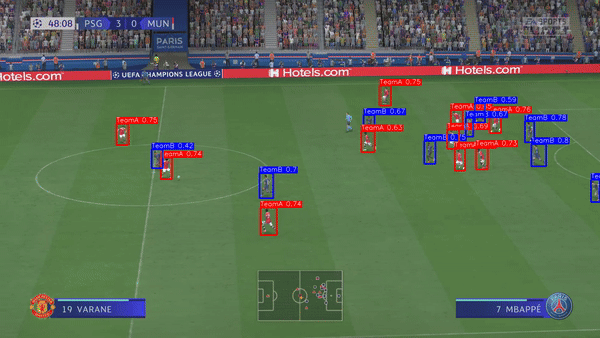

# Object Detection in FIFA Game

## About This Project
The "Object Detection in FIFA Game" project is at the forefront of integrating AI with sports gaming, utilizing YOLOv8, Streamlit, and OpenCV technologies. It aims to transform in-game analytics by accurately identifying elements such as Team A, Team B, and the ball within FIFA game footage. This initiative uses YOLOv8 for its exceptional real-time object detection capabilities, trained on a dataset comprising 1000 images and over 5000 annotations. OpenCV is employed to efficiently process video frames, ensuring precise object identification. Furthermore, Streamlit is leveraged to deploy this model, offering an interactive user interface that demonstrates the model's performance. This project not only elevates the gaming experience but also paves the way for innovative strategies in game analysis and coaching, marking a significant leap in the fusion of sports gaming and artificial intelligence.

## Open Community Repository
This repository is an open community project. We encourage everyone to contribute, enhance, and share their innovations with us. You are free to fork this repository, make modifications, and propose new changes through pull requests. However, we require that all users who utilize or modify this code credit the original creator by tagging the owner. This acknowledgment is mandatory for any redistribution or use of the project code.

### How to Fork This Repository
1. Go to [Rajbir Singh's Object Detection Repository](https://github.com/rsturka/Object-Detection-IN-FIFA-GAME).
2. In the top-right corner of the page, click the "Fork" button.
3. Choose the account you want to fork the repository to. The process will start automatically, and you'll have your own fork of the repository.

### How to Clone Your Forked Repository
1. Navigate to your fork of the repository on GitHub.
2. Above the list of files, click the "Code" button.
3. To clone the repository using HTTPS, under "Clone with HTTPS", click the clipboard icon. To clone the repository using an SSH key and passphrase, click Use SSH, then click the clipboard icon. To clone a repository using GitHub CLI, click Use GitHub CLI, then click the clipboard icon.
4. Open your terminal.
5. Change the current working directory to the location where you want the cloned directory.
6. Type in terminal
   ```bash
   git clone https://github.com/YOUR-USERNAME/Object-Detection-in-Video-Streams
   ```
7. Press Enter to create your local clone.

### How to Run This Code
1. Ensure you have Streamlit and open-cv installed in your environment. If not, you can install it using pip:
   ```bash
   pip install streamlit
   pip install opencv-python
   ```
2. Navigate to the home directory of the cloned repository.
3. Run the Streamlit application by executing
   ```bash
   streamlit run V2.py
   ```

### How to Send Pull Requests
1. After making your changes in the forked repository, push your changes to your GitHub repository.
2. Go to the original repository you forked from.
3. Click the "Pull requests" tab and then click the "New pull request" button.
4. Choose your fork as the compare branch and the original repository's branch you want to contribute to as the base branch.
5. Review the changes, add a description of your updates, and click "Create pull request".

We appreciate your contributions and are excited to see how this project evolves with the community's input. For any queries or discussions, please feel free to open an issue in the repository.
